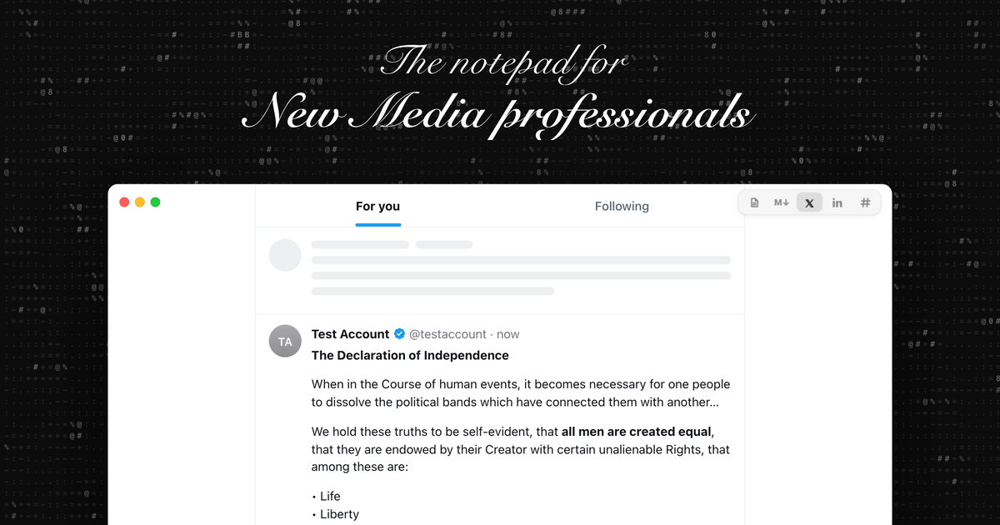
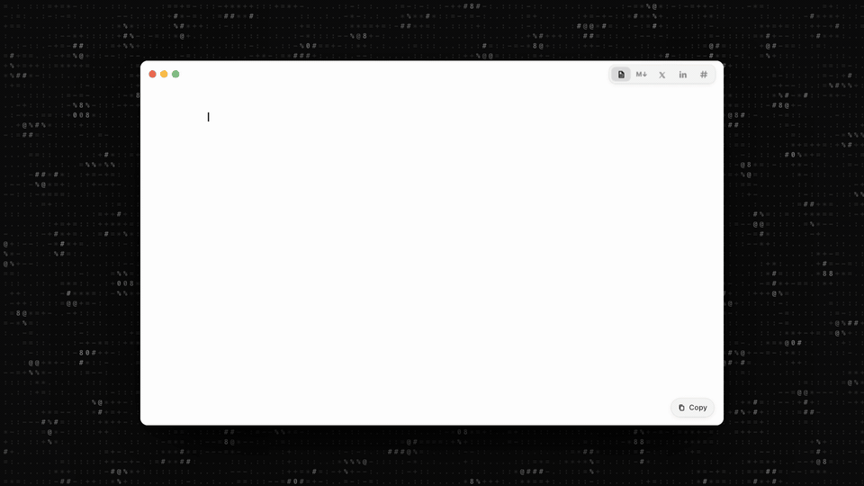

# New Media Writer

[](https://newmediawriter.app/)

[](https://builtbydevin.ai)

**[newmediawriter.app](https://newmediawriter.app/)** — download for Mac.



A minimalist, focus-first Markdown writing app for macOS. Write once in Markdown, then preview the same file as it would appear in the feed:

- **Plaintext** — the raw Markdown source.
- **Markdown** — Typora-style WYSIWYG (syntax hides when the cursor leaves the line).
- **X** — post (threads split on `---`, Premium 25k counter, bold/italic preserved).
- **LinkedIn** — full post with the "…more" fold marked at ~210 chars, 3,000 cap.
- **Slack** — channel view with mrkdwn-style rendering.

Images pasted or dropped into the editor are copied to an `assets/` folder next to the document and inserted as relative Markdown links; they render inline in the editor and as media in every preview.

Every view has a **Copy** button (⇧⌘C) that puts the document on the clipboard in the format that view's composer expects: raw Markdown, rich text for X (per-post for threads), plain text for LinkedIn, and Slack mrkdwn (`*bold*`, `_italic_`, `•` bullets, `>` quotes, fenced code) plus an HTML flavor for Slack's rich composer.

## Build

Requires Xcode 16+ and [xcodegen](https://github.com/yonaskolb/XcodeGen) (`brew install xcodegen`).

```sh
xcodegen generate
xcodebuild -project NewMediaWriter.xcodeproj -scheme NewMediaWriter -configuration Debug -derivedDataPath build CODE_SIGNING_ALLOWED=NO build
open "build/Build/Products/Debug/New Media Writer.app"
```

Or open `NewMediaWriter.xcodeproj` in Xcode and run.

## Releasing

Pushing a tag like `v0.2.0` runs `.github/workflows/release.yml`, which builds a Release archive signed with a
Developer ID certificate (hardened runtime), notarizes it, wraps it in a DMG, notarizes and staples the DMG and
attaches it to a GitHub Release. The tag (minus `v`) becomes the app version. Pushing a `release-dry-run/**`
branch runs the same signing + notarization and uploads the DMG as a workflow artifact without publishing a Release.

Repository secrets it expects:

| Secret | Value |
| --- | --- |
| `MAC_CERT_P12` | base64 of a "Developer ID Application" certificate exported as `.p12` (`base64 -i cert.p12`) |
| `MAC_CERT_PASSWORD` | password used when exporting the `.p12` |
| `APPLE_TEAM_ID` | 10-character team ID from developer.apple.com → Membership |
| `NOTARY_KEY_P8` | base64 of an App Store Connect API key (`.p8`, Team Key, role Developer) |
| `NOTARY_KEY_ID` | the key's ID |
| `NOTARY_ISSUER_ID` | the issuer ID shown on the Integrations → Team Keys page |

Local builds keep ad-hoc signing (`CODE_SIGN_IDENTITY: "-"` in `project.yml`); nothing here changes how you run
from Xcode.

## Shortcuts

| Action | Keys |
| --- | --- |
| Plaintext | ⌘1 |
| Markdown | ⌘2 |
| X | ⌘3 |
| LinkedIn | ⌘4 |
| Slack | ⌘5 |
| Copy for current view | ⇧⌘C |
| Bold / Italic / Inline code (toggle `**` / `*` / `` ` `` around the selection) | ⌘B / ⌘I / ⌘E |
| Switch view by typing its name (e.g. "sl" → Slack) | ⌘K |
| Previous / next view | ⌥⌘← / ⌥⌘→ |
| Insert link (uses a URL from the clipboard if there is one) | ⇧⌘K |
| Bulleted / numbered list (Enter continues a list, Enter on an empty item ends it) | ⌥⌘U / ⌥⌘O |

Set your name, handle, headline, avatar and Slack channel in **Settings (⌘,)** so previews look like you.
